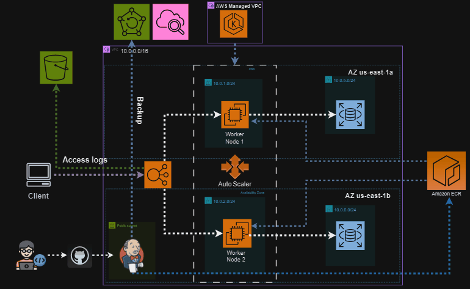

# NTI DevOps Final Project

This project involves setting up a comprehensive DevOps environment using a variety of tools including Terraform, Ansible, Docker, Kubernetes, and Jenkins. The setup includes creating and managing an EKS cluster, RDS instance, EC2 instances, and configuring CI/CD pipelines.

## Project Structure

1. *Terraform*
    - Create an EKS Cluster with two nodes, an auto-scaling group, and an ELB.
    - Set up an RDS instance and store its username and password in AWS Secret Manager.
    - Provision an EC2 instance to run Jenkins.
    - Configure daily snapshots of the Jenkins instance using AWS Backup Service.
    - Save ELB access logs to an AWS S3 Bucket.
    - Create an AWS ECR repository.

2. *Ansible*
    - Install Jenkins including its configuration and necessary plugins.
    - Install the CloudWatch agent on all EC2 instances in the project.

3. *Docker*
    - Create Docker images for the application code.
    - Set up Docker Compose to run the app locally.

4. *Kubernetes*
    - Create Kubernetes manifests and apply them to the AWS EKS cluster.
    - Implement network policies to ensure security best practices between pods.

5. *Jenkins*
    - Set up a multi-branch pipeline to build on every push to all GitHub branches.
    - Pipeline stages:
        - Build the Dockerfile in the repository.
        - Push the Docker image to ECR.
        - Deploy the new image to Kubernetes pods.

## Getting Started

### Prerequisites

- AWS account with necessary permissions.
- Terraform installed.
- Ansible installed.
- Docker and Docker Compose installed.
- kubectl installed.
- Jenkins installed or the ability to set up Jenkins.

### Setup Instructions

1. *Terraform*
    - Navigate to the terraform directory and initialize Terraform:
      bash
      terraform init
      
    - Apply the Terraform configuration to set up the infrastructure:
      bash
      terraform apply
      

2. *Ansible*
    - Navigate to the ansible directory and run the playbooks to configure Jenkins and install the CloudWatch agent:
      bash
      ansible-playbook playbook.yaml
      

3. *Docker*
    - Navigate to the docker directory and build the Docker images:
      bash
      docker build -t my-app .
      
    - Use Docker Compose to run the application locally:
      bash
      docker-compose up
      

4. *Kubernetes*
    - Navigate to the kubernetes directory and apply the manifests to the EKS cluster:
      bash
      kubectl apply -f .
      

5. *Jenkins*
    - Set up the multi-branch pipeline in Jenkins to automate the build and deployment process.

## Usage

- Monitor the EKS cluster and other resources using AWS Management Console.
- Use Jenkins to manage the CI/CD pipelines and monitor builds.
- Ensure security best practices are followed by reviewing network policies and configurations.

## Contributing

Contributions are welcome! Please fork the repository and submit a pull request for any improvements or bug fixes.

## License

This project is licensed under the MIT License.

## Acknowledgements

- AWS for providing the cloud infrastructure.
- The open-source community for the tools and plugins used in this project.